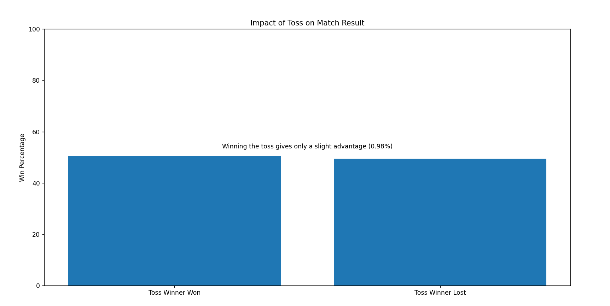
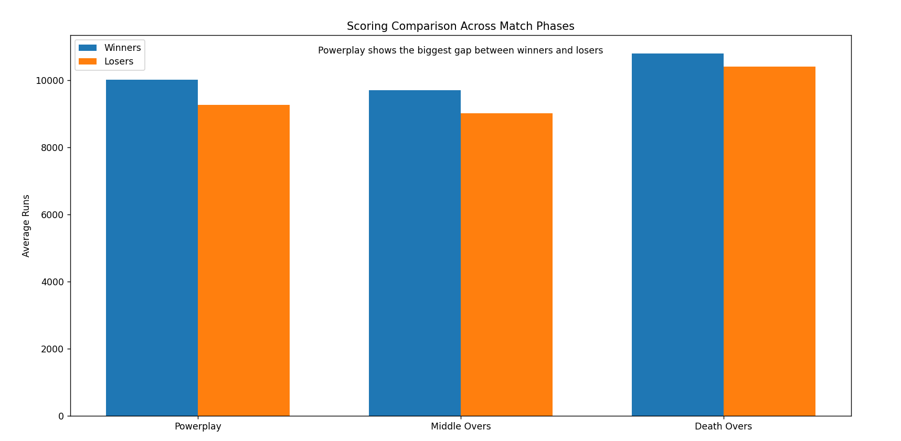
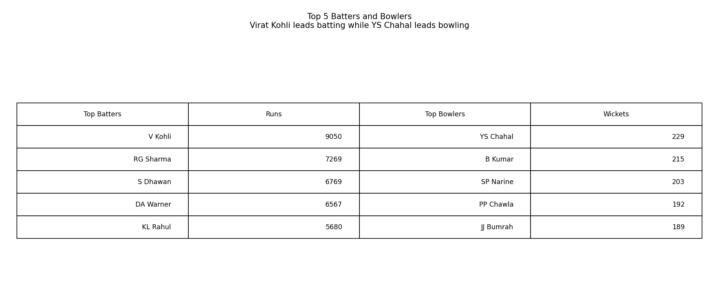

# IPL-CRUNCH-26
> **Five Seasons of IPL Data. To Find Out What Actually Wins Matches.**  
> Submission for the [Wooble IPL CRUNCH '26 Hackathon](https://wooble.org/hackathon/crunch-26)

---

## 📌 What This Project Does

This project analyses five seasons of ball-by-ball IPL data to answer three questions every cricket fan has argued about:

| Question |
|---|
| Does winning the toss actually matter? |
| Which phase wins matches? Powerplay-MiddleOvers-DeathOvers|
| Who are the top 5 batters and bowlers of previous 5 seasons? |

---

## 📊 Charts

### Chart 1 — Toss Impact on Match Result


Toss winners win ~51% of the time. The difference is statistically negligible.  
**Conclusion: Winning the toss gives only a slight (~1%) advantage.**

---

### Chart 2 — Scoring by Phase: Winners vs Losers


Winners outscore losers in **all three phases**, but the **powerplay gap is the largest**.  
**Conclusion: Teams that dominate the powerplay win more often than teams that dominate the death overs.**

---

### Chart 3 — Top 5 Batters & Bowlers (5 Seasons)


Virat Kohli leads all run-scorers. YS Chahal leads all wicket-takers (bowler wickets only — run-outs excluded).

---

## 💡 Surprising Insight

> **The powerplay had a bigger impact on winning than the death overs.**  
> Most fans assume finishing power (death overs) is the key differentiator — the data says otherwise. Teams that set up early through the powerplay win far more consistently.

---

## 🗂️ Repo Structure

```
IPL-CRUNCH-26/
│
├── ipl_analysis.py          # Main analysis + all 3 charts
├── requirements.txt         # Python dependencies
├── README.md                # This file
│
├── chart1_toss_impact.png   # Output chart 1
├── chart2_phase_scoring.png # Output chart 2
└── chart3_top_players.png   # Output chart 3
```

> ⚠️ The dataset (`ipl_matches.csv`) is **not included** in this repo due to file size.  
> Download it from the [Wooble hackathon page](https://wooble.org/hackathons) attachments or from [cricsheet.org](https://cricsheet.org/matches/).

---

## 🚀 How to Run

**1. Clone the repo**
```bash
git clone https://github.com/vishnuayure/IPL-CRUNCH-26.git
cd IPL-CRUNCH-26
```

**2. Install dependencies**
```bash
pip install -r requirements.txt
```

**3. Add the dataset**

Download `ipl_matches.csv` and place it in the same folder as `ipl_analysis.py`.

**4. Run the analysis**
```bash
python ipl_analysis.py
```

Charts will be saved as PNG files in the same directory.

---

## 🔍 Methodology

- **Data**: Ball-by-ball IPL data (5 seasons) from cricsheet.org
- **Toss analysis**: Compared `toss_winner` vs `winner` columns on deduplicated match rows
- **Phase analysis**: Grouped `runs_total` by `over` index; split into Powerplay (0–5), Middle (6–14), Death (15–19)
- **Wickets**: Excluded non-bowler dismissals (`run out`, `retired hurt`, `retired out`, `obstructing the field`) for fair bowler ranking
- **Visualisation**: matplotlib with a custom dark IPL-themed colour palette

---

## 🛠️ Tech Stack

- Python 3.x
- pandas
- matplotlib
- numpy

---

*Built for IPL CRUNCH '26 on Wooble · May 2026*
